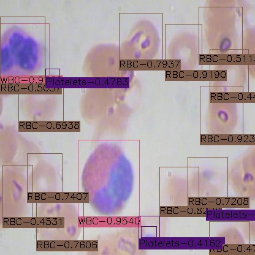
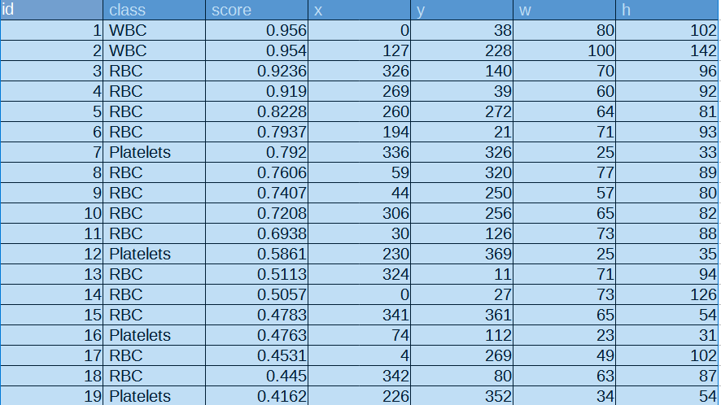
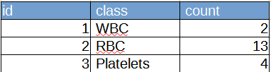

# Keras-EfficientDet
This is a simple extension of the implementation of [EfficientDet](https://github.com/xuannianz/EfficientDet) for object detection on Keras and Tensorflow. 
On detail, please see: [EfficientDet](https://github.com/xuannianz/EfficientDet) 

**NEW Python Scripts [01/05/2021]**
- <a href="./EfficientDetFinetuningModel.py">EfficientDetFinetuningModel.py</a>
- <a href="./EfficientDetObjectDetector.py">EfficientDetObjectDetector.py</a>
- <a href="./EpochChangeCallback.py">EpochChangeCallback.py</a>
- <a href="./TrainConfig.py">TrainConfig.py</a>
- <a href="./TrainConfigGenerator.py">TrainConfigGenerator.py</a>
- <a href="./TrainConfigParser.py">TrainConfigParser.py</a>
- <a href="./TrainingResultWriter.py">TrainingResultWriter.py</a>

### Create projects folder

 Please create <i>projects</i> folder on your local work folder 
<pre>
    work/
      + keras-efficientdet/
      + projects/
</pre>

### Create a project folder and deploy a dataset 

 Please create your own <i>demo</i> folder under the <i>projects</i> folder,
   and a <i> dataset</i> folder which contains <i>train</i>, <i>valid</i>, <i>test</i> folders.
   Those folders contain coco-annotation files and jpg image files.
Currently, the supported annotation file format is the coco-annotation format only.
<pre>
    work/
      + keras-efficientdet/
      + projects/
        + demo/
          + dataset/
            + train/
               + _annotation.coco.json
               + something.jpg

            + valid/
               + _annotation.coco.json
               + something.jpg

            + test/
               + _annotation.coco.json
               + something.jpg
</pre>
### Generate a configuration file

 In keras-efficientdet folder, please run the follwing command in terminal console 
 to create configuration files.
 
<b>
keras-efficientdet>python TrainConfigGenerator.py project dataset 
</b>
 
Example:
 
keras-efficientdet>python TrainConfigGenerator.py demo BloodCells 
 
 On BloodCells dataset, see Roboflow public dataset BCCD (https://public.roboflow.com/object-detection/bccd)
 
By running the above command, configration file will be generated in <i>config</i> folder under the dataset folder.
<pre>
    work/
      + keras-efficientdet/
      + projects/
        + demo/
          + BloodCells/
            + config/
              + 1_B_8_L_0.0001_P_15_E_300_D_0.config
</pre>
 
The generated config file will be in the following format.

<pre>
[project]
name = demo
owner = {OWNER}

[model]
dataset_name = BloodCells
num_classes = 3
classes = ['Platelets', 'RBC', 'WBC']
efficient_det = 0
config_dir = ../projects/{PROJECT}/{DATASET_NAME}/config
models = ../projects/demo/BloodCells/models
best_model = ../projects/demo/BloodCells/best_model

[train_config]
batch_size = 8
epochs = 300
learning_rate = 0.0001

[early_stopping]
patience = 15

[train]
train_data_path = ../projects/demo/BloodCells/train

[valid]
valid_data_path = ../projects/demo/BloodCells/valid

[test]
test_data_path = ../projects/demo/BloodCells/test

</pre>

### Train the dataset by EfficientDetFinetuningModel.py
 Run the following command to train your own dataset on the configuration file
generated above.
 
<b>
keras-efficientdet>python EfficientDetFinetuningModel.py configurationfile 
</b>
 
Example:
 
keras-efficientdet>python EfficientDetFinetuningModel.py ../projects/demo/BloodCells/config/1_B_8_L_0.0001_P_15_E_300_D_0.config

 

 
 

### Detect objects by EfficientDetObjectDetector.py

 Run the following command to detect objects in an image by using a model
trained by EfficientDetFinetuningModel.
 
<b>
keras-efficientdet>python EfficientDetObjectDetector.py image_file_or_dir dataset_dir  
</b>
 
Example:
 
keras-efficientdet>python EfficientDetObjectDetector.py ../projects/demo/BloodCells/test ../projects/demo/BloodCells
 
 
The detected object image files will be saved into ../projects/demo/BloodCells/output folder.
 
 

  
This detector EfficientDetObjectDetector.py will generate a detected image, detected_objects_detail.csv, detected_objects_stats.csv
for each image, as shown below.
 

 
 
detected_objects_detail.csv
 

 

detected_objects_stats.csv
 

 

